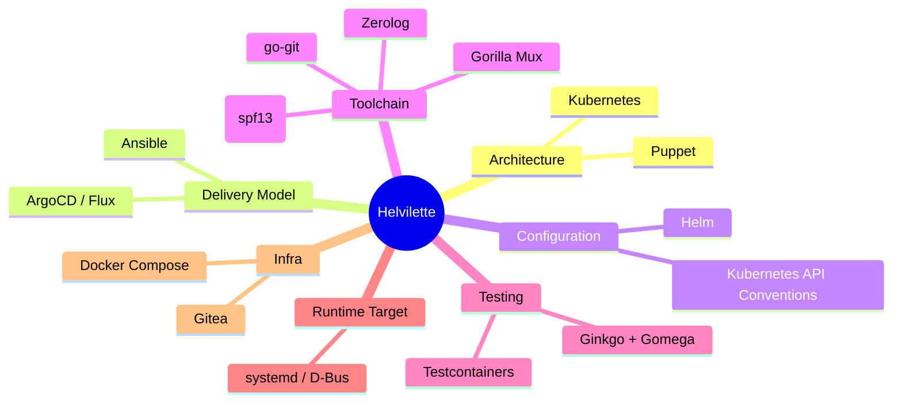

# 🐈‍⬛ Phả Hệ của Helvilette — Genealogy of a Hybrid

Helvilette là đứa con lai của ít nhất **10 phần mềm / hệ sinh thái OSS vĩ đại**, trải dài từ tầng kiến trúc vĩ mô (architecture) xuống từng dòng code cụ thể (implementation). Dưới đây là bản phân tích DNA đầy đủ.

---

## 🧬 Bản đồ DNA tổng quan



---

## 1. 🏛️ Kubernetes — Cha ruột (Architecture DNA: ~60%)

Kubernetes là ảnh hưởng **chi phối nhất**. Helvilette không chỉ "lấy cảm hứng" mà gần như **transpose toàn bộ kiến trúc K8s xuống tầng OS/systemd**.

### 1.1 Control Plane ↔ Worker Pattern

| Kubernetes | Helvilette | Evidence |
|---|---|---|
| `kube-apiserver` | **Othela** ([server.go](file:///home/stella/workspace/naughtian-helvilette/cmd/othela/server.go)) | REST API server, dispatches work to nodes |
| `kubelet` | **Agent** ([main.go](file:///home/stella/workspace/naughtian-helvilette/cmd/agent/main.go)) | Polling loop, pulls work, executes, reports |
| Pod scheduling | `handleSync()` ([server.go#L238](file:///home/stella/workspace/naughtian-helvilette/cmd/othela/server.go#L238)) | Label matching → dispatch job |
| kubelet registration | `RegisterNode()` ([main.go#L181](file:///home/stella/workspace/naughtian-helvilette/cmd/agent/main.go#L181)) | Agent phải `POST /nodes/register` trước khi nhận work |

### 1.2 API Conventions & Resource Model

Helvilette clone gần như **1:1** bộ API conventions của K8s:

```yaml
# helvilette.yml — nhìn giống K8s manifest đến mức uncanny
apiVersion: apps/v1        # ← K8s apiVersion
kind: Cluster              # ← K8s kind
metadata:                  # ← K8s metadata
  name: "..."
  namespace: "default"     # ← K8s namespace
  labels: {}               # ← K8s labels
spec:                      # ← K8s spec
  nodeGroups:
    - nodeSelector: {}     # ← K8s nodeSelector (identical)
```

Source: [manifest/types.go](file:///home/stella/workspace/naughtian-helvilette/pkg/manifest/types.go) — Struct fields map trực tiếp: `APIVersion`, `Kind`, `Metadata`, `Spec`, `NodeSelector`.

### 1.3 Health Probes

```go
// server.go — K8s-style health probes
s.router.HandleFunc("/healthz", s.handleHealthz)  // ← liveness probe
s.router.HandleFunc("/readyz", s.handleReadyz)     // ← readiness probe
```

Thậm chí cả concept `readiness = false` khi shutdown ([server.go#L358](file:///home/stella/workspace/naughtian-helvilette/cmd/othela/server.go#L358)) cũng là pattern của `kube-apiserver`.

### 1.4 Configuration Priority Chain

```text
CLI Flags > YAML Config > ENV Vars > Defaults
```

Đây chính xác là kubelet configuration priority. Xem [LoadConfig()](file:///home/stella/workspace/naughtian-helvilette/cmd/agent/main.go#L60-L159).

### 1.5 Planned K8s Patterns (from DESIGN_PROPOSAL)

Còn **nhiều K8s pattern nữa** đang nằm trong roadmap:

- `CrashLoopBackOff` → Systemd service restart backoff
- `ImagePullBackOff` → `GitPullBackOff`
- `DaemonSet` → Run playbook on all nodes
- `Job` / `CronJob` → One-time / scheduled execution
- `Taints & Tolerations` → Production protection
- `Events` → `PlaybookApplied`, `DriftDetected`, `SelfHealed`
- `Rolling Update Strategy` → Sequential node updates
- `Annotations` → `helvilette.io/last-applied`, `helvilette.io/rollback-to`

> **Verdict:** Kubernetes là bố ruột. Helvilette kế thừa từ API surface, architecture, configuration model, đến health check conventions, và thậm chí cả tên gọi concept (`nodeSelector`, `livenessProbe`, `nodeGroup`).

---

## 2. 🤖 Puppet — Mẹ ruột (Architecture DNA: ~15%)

Puppet là tool pull-based configuration management lâu đời nhất. Helvilette thừa kế **mô hình agent pull-based** từ Puppet:

| Puppet | Helvilette |
|---|---|
| Puppet Agent polls Puppet Server | Agent polls Othela |
| Catalog (desired state) | Job + helvilette.yml |
| Convergence loop | Reconciliation loop |
| `puppet agent -t` | Agent polling cycle |
| Facter (node facts) | Agent labels |
| Certificate-based auth (planned) | mTLS / API key (planned) |

**Nhưng Helvilette "nổi loạn"**: từ chối DSL riêng (Puppet DSL), từ chối Hiera, từ chối PuppetDB. Thay vào đó dùng YAML + Ansible — tức là giữ lại kiến trúc pull nhưng đổi sang ngôn ngữ phổ thông.

> **Verdict:** Puppet là mẹ ruột. Kiến trúc agent-based, pull-based, desired-state convergence là DNA gốc. Nhưng Helvilette đã bỏ mọi thứ phức tạp (DSL, Hiera, Facter) để "sinh ra nhẹ nhàng hơn".

---

## 3. 🔄 ArgoCD / Flux — Bố nuôi GitOps (Delivery DNA: ~10%)

ArgoCD và Flux định nghĩa mô hình **GitOps** mà Helvilette áp dụng:

| ArgoCD / Flux | Helvilette |
|---|---|
| Git repo = single source of truth | Git repo chứa playbooks + `helvilette.yml` |
| Continuous sync loop | Agent polling + reconciliation |
| Drift detection | `ansible-playbook --check` (planned) |
| Auto-sync on git push | Webhook triggers (planned) |
| Application manifest | `helvilette.yml` |

**Khác biệt then chốt**: ArgoCD/Flux hoạt động *bên trong* K8s cluster. Helvilette hoạt động *bên ngoài* — ở tầng OS, nơi K8s không thể chạm tới.

> **Verdict:** ArgoCD/Flux là bố nuôi. Helvilette học được triết lý "Git là truth, reconcile liên tục" nhưng mang nó ra khỏi K8s cluster, xuống tầng bare-metal.

---

## 4. ⚙️ Ansible — Bà ngoại (Execution DNA: ~5%)

Ansible **không phải là ảnh hưởng thiết kế** mà là **execution engine** bên dưới. Helvilette không thay thế Ansible — nó **delivery** Ansible:

```go
// agent/main.go — Ansible là "container runtime" của Helvilette
cmd := exec.Command("ansible-playbook", "-i", "localhost,", "-c", "local", playbookFile)
cmd.Env = append(os.Environ(), "ANSIBLE_STDOUT_CALLBACK=json")
```

Source: [ExecutePlaybook()](file:///home/stella/workspace/naughtian-helvilette/cmd/agent/main.go#L276-L380)

Tương tự cách K8s dùng `containerd` để chạy container, Helvilette dùng `ansible-playbook` để chạy configuration. Ansible là **container runtime** của Helvilette.

| K8s analogy | Helvilette reality |
|---|---|
| `containerd` / `CRI-O` | `ansible-playbook` binary |
| OCI image | Ansible playbook repo |
| `docker pull` | `git clone` |
| Container logs (JSON) | `ANSIBLE_STDOUT_CALLBACK=json` |

> **Verdict:** Ansible là bà ngoại — nền tảng mà cả gia đình đứng trên, nhưng không trực tiếp quyết định kiến trúc.

---

## 5. ⎈ Helm — Cô ruột (Configuration DNA: ~3%)

`helvilette.yml` chính là **Helm chart cho bare metal**:

| Helm | Helvilette |
|---|---|
| `Chart.yaml` (metadata) | `metadata:` section |
| `values.yaml` (user config) | `spec.nodeGroups[].ansible.extra_vars` |
| `templates/` (rendered manifests) | Ansible playbooks + roles |
| Release per namespace | nodeGroup per label set |
| `helm install --set key=val` | Agent `--labels="role=edge-proxy"` |

Source: [AnsibleConfig.ExtraVars](file:///home/stella/workspace/naughtian-helvilette/pkg/manifest/types.go#L30-L33) maps directly to Helm values concept.

> **Verdict:** Helm là cô ruột — ảnh hưởng rõ nét ở cách `helvilette.yml` cấu trúc config, nhưng scope nhỏ hơn K8s.

---

## 6. 🔧 Toolchain — Dòng họ bên nội (Go ecosystem)

### 6.1 Cobra (spf13/cobra) — Ông nội CLI

```go
var rootCmd = &cobra.Command{
    Use:   "agent",
    Short: "Helvilette Node Agent",
```

**Cùng framework với**: `kubectl`, `helm`, `docker`, `hugo`, `etcd`, `istioctl`, `terraform`.

Helvilette dùng Cobra cho cả Othela ([cmd/othela/cmd/](file:///home/stella/workspace/naughtian-helvilette/cmd/othela/cmd)) và Agent ([main.go#L507](file:///home/stella/workspace/naughtian-helvilette/cmd/agent/main.go#L507)), chính xác theo pattern của K8s components.

### 6.2 Gorilla Mux — Bà nội HTTP

```go
s.router = mux.NewRouter()
s.router.HandleFunc("/api/v1/sync/{node_id}", s.handleSync).Methods("GET")
```

Source: [server.go#L174-L183](file:///home/stella/workspace/naughtian-helvilette/cmd/othela/server.go#L174-L183). Gorilla Mux là HTTP router kinh điển của Go ecosystem.

### 6.3 go-git — Cậu ruột Git

```go
import "github.com/go-git/go-git/v5"
```

Pure Go implementation của Git. Agent dùng `go-git` để clone/pull repo mà không cần shell out ra `git` binary — giống cách ArgoCD dùng go-git.

Source: [pkg/git/clone.go](file:///home/stella/workspace/naughtian-helvilette/pkg/git/clone.go)

### 6.4 Zerolog (rs/zerolog) — Chú ruột Logging

```go
logger := log.WithComponent("agent").With().Str("node_id", a.config.NodeID).Logger()
logger.Info().Str("othela_url", config.OthelaURL).Msg("Agent started")
```

Structured JSON logging, zero allocation. Ảnh hưởng từ triết lý observability hiện đại.

### 6.5 coreos/go-systemd — Dì ruột D-Bus

```go
import "github.com/coreos/go-systemd/v22/dbus"
```

Library từ CoreOS (cùng nhà với etcd, rkt). Helvilette dùng nó để **subscribe systemd unit state changes qua D-Bus** — đây là kênh real-time để theo dõi services.

Source: [pkg/systemd/watcher.go](file:///home/stella/workspace/naughtian-helvilette/pkg/systemd/watcher.go) — `SubscribeUnitsCustom()` là D-Bus subscription pattern.

---

## 7. 🧪 Testing — Họ hàng bên ngoại

### 7.1 Ginkgo + Gomega — K8s Testing DNA

```go
import (
    . "github.com/onsi/ginkgo/v2"
    . "github.com/onsi/gomega"
)
```

**Ginkgo** là BDD testing framework mà **chính Kubernetes dùng cho E2E tests**. Việc Helvilette chọn Ginkgo không phải ngẫu nhiên — nó là continuation của K8s DNA.

### 7.2 Testcontainers-Go

Spin up Docker containers programmatically trong tests. Ảnh hưởng từ Java ecosystem (Testcontainers.org), adapted cho Go.

---

## 8. 🐳 Docker Compose + Gitea — Anh em họ Infra

- **Docker Compose**: Ephemeral lab (1 Othela + N Agents + git-server). Xem [docker-compose.e2e.yaml](file:///home/stella/workspace/naughtian-helvilette/docker-compose.e2e.yaml).
- **Gitea**: Lightweight self-hosted Git server, dùng trong E2E tests làm "container registry" cho playbooks.

---

## 9. 🏗️ systemd — Nền tảng gốc (Target Layer)

Helvilette không "dùng" systemd như dependency — nó **target** systemd. systemd là "operating system" mà Helvilette quản lý, giống cách K8s quản lý containers.

```go
// systemd/types.go — Map 1:1 systemd state machine
ActiveStateActive   = "active"
ActiveStateFailed   = "failed"
SubStateRunning     = "running"
LoadStateLoaded     = "loaded"
```

Planned: `livenessProbe` / `readinessProbe` cho systemd services — một concept **chưa từng tồn tại** trước Helvilette. Puppet không có. SaltStack không có. Chỉ K8s có, nhưng chỉ cho containers.

---

## 10. 📋 CNCF Ecosystem — Gia phong (Governance DNA)

- **Apache License 2.0** — cùng license với K8s
- **CNCF Code of Conduct v1.3**
- README template theo chuẩn [CNCF project-template](https://github.com/cncf/project-template)
- Roadmap nhắm tới **CNCF Sandbox** application

---

## Tổng kết — Cây phả hệ

```text
                    ┌──────────────┐
                    │  Kubernetes  │ ← Cha ruột (60% DNA)
                    │  (K8s API,   │   apiVersion, kind, metadata, spec,
                    │   kubelet,   │   nodeSelector, probes, Cobra CLI,
                    │   apiserver) │   registration-first, config priority
                    └──────┬───────┘
                           │
          ┌────────────────┼────────────────┐
          │                │                │
   ┌──────┴──────┐  ┌──────┴──────┐  ┌──────┴──────┐
   │   Puppet    │  │ ArgoCD/Flux │  │    Helm     │
   │ (pull-based │  │  (GitOps,   │  │ (values.yml │
   │  agent,     │  │  git=truth, │  │  config     │
   │  converge)  │  │  reconcile) │  │  pattern)   │
   └──────┬──────┘  └──────┬──────┘  └─────────────┘
          │                │
          └────────┬───────┘
                   │
          ┌────────┴────────┐
          │   HELVILETTE    │
          │   🐈‍⬛           │
          └────────┬────────┘
                   │
    ┌──────────────┼──────────────┐
    │              │              │
┌───┴────┐  ┌─────┴─────┐  ┌────┴─────┐
│Ansible │  │  systemd   │  │  Go OSS  │
│(exec   │  │  (target   │  │(Cobra,   │
│engine) │  │   layer)   │  │ Mux,     │
│        │  │            │  │ go-git,  │
└────────┘  └────────────┘  │ zerolog, │
                            │ Ginkgo)  │
                            └──────────┘
```

| Ancestor | DNA % | Thừa kế gì |
|---|---|---|
| **Kubernetes** | ~60% | Architecture, API conventions, resource model, health probes, config priority, CLI framework, testing framework, governance |
| **Puppet** | ~15% | Pull-based agent architecture, desired-state convergence, periodic reconciliation |
| **ArgoCD / Flux** | ~10% | GitOps philosophy, git-as-truth, continuous sync, drift detection |
| **Ansible** | ~5% | Execution engine, playbook format, role resolution |
| **Helm** | ~3% | Declarative config packaging, values/extra_vars pattern |
| **Go ecosystem** | ~5% | Cobra, Gorilla Mux, go-git, zerolog, go-systemd, Ginkgo |
| **CNCF** | ~2% | License, governance, community standards |

> **Kết luận**: Helvilette là con lai của **Kubernetes** (cha ruột, chi phối architecture) và **Puppet** (mẹ ruột, chi phối delivery model), được nuôi dưỡng bởi **ArgoCD/Flux** (bố nuôi GitOps), chạy trên lưng **Ansible** (bà ngoại execution), với ngoại hình giống **Helm** (cô ruột config), và vũ khí từ **Go ecosystem** (họ hàng bên nội).
>
> Điều thú vị là: không có phần mềm nào trước đây **kết hợp tất cả các yếu tố này** ở tầng OS/systemd. K8s làm ở tầng container. Puppet làm ở tầng OS nhưng bằng DSL riêng. ArgoCD làm GitOps nhưng chỉ trong K8s. Helvilette lấy **điểm mạnh nhất** của từng "cha mẹ" và sinh ra ở một niche mà không ai chiếm: **GitOps pull-based Ansible delivery cho bare-metal/VM/edge**.
